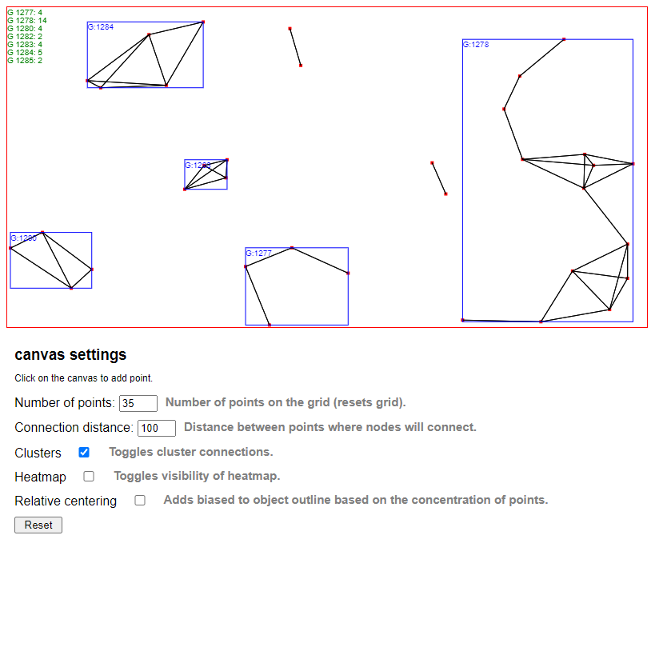

## Heatmap / Cluster finder
This is a little small project I made as a part of my other camera motion detector project. I needed that to be able to detect which pixels have changed on an image and to create a general position and size of the object. This worked well.

You can demo this here https://nazar1000.github.io/

This website containst 2 main features
- Heatmap - detects the concentration of points in an area and marks it, stronger color means more.
- Cluster finder - Links a chain of points together and marks them as a cluster

- (Heatmap disabled in the image)

## Potential improvements
- [ ] ID of clusters could start from 0 instead of random 4 digit number :P
- [ ] Legend for the heatmap max and min values.
- [ ] Not enough comments in the code :P
